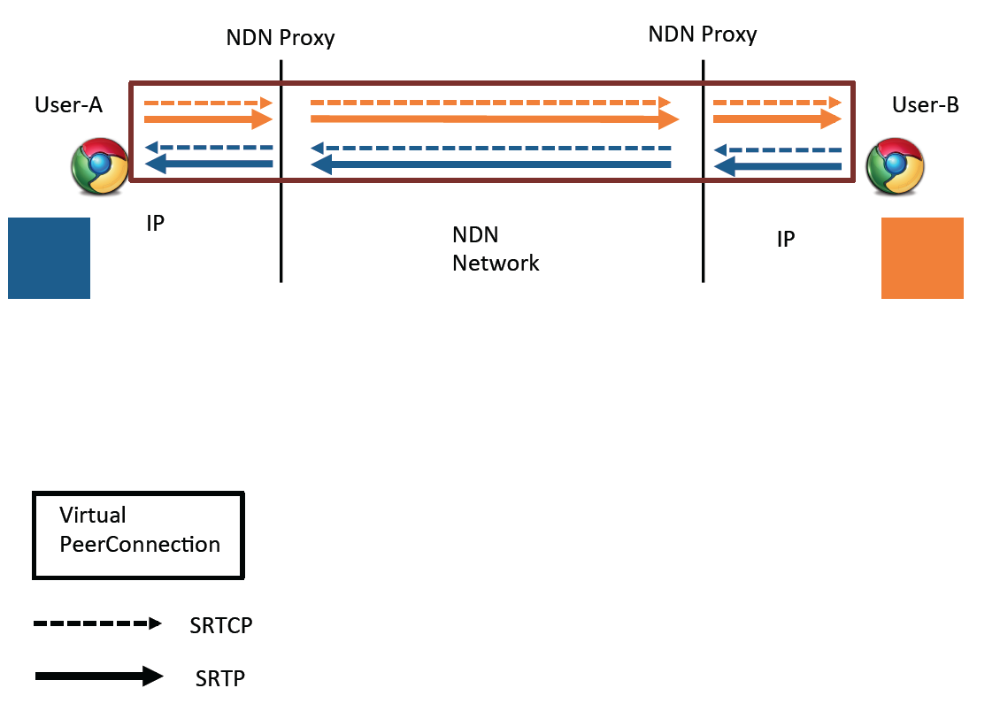
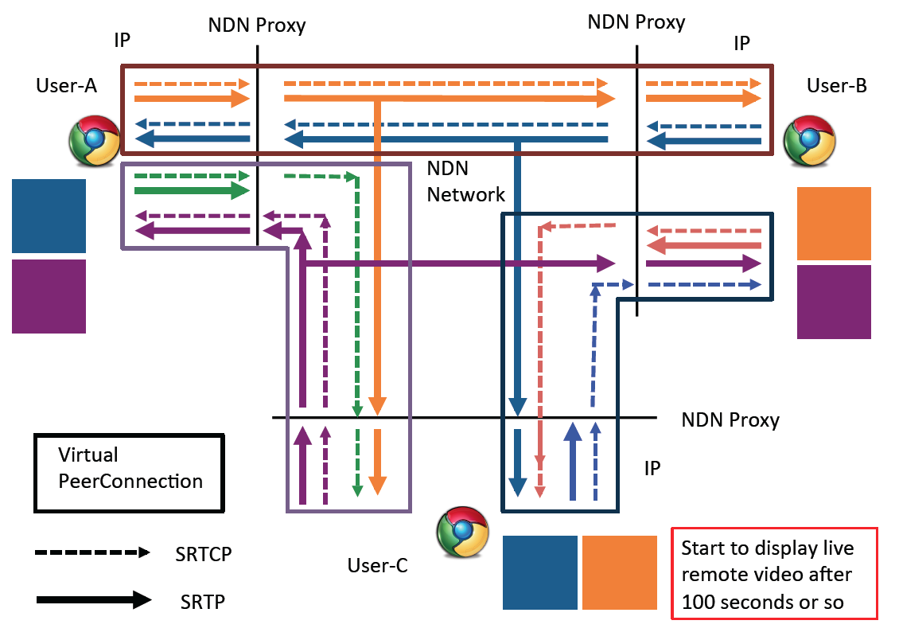

.. Peets documentation master file, created by
   sphinx-quickstart on Mon Dec 10 16:33:13 2012.
   You can adapt this file completely to your liking, but it should at least
   contain the root `toctree` directive.

Welcome to Peets's documentation!
=================================

Contents: This is a documentation for Peets backend.

.. toctree::
   :maxdepth: 2

Overview
========
Peets is an effort to support multi-party audio/video conferencing over Named Data Networking using WebRTC. WebRTC is getting a momentum and is currently supported in Google Chrome browswer. Firefox and Opera are going to support it in the near future.

WebRTC, however, is deeply based on a Peer-to-Peer notion, making it difficult to have a conference with a large number of participants, as the number of peer connection needed (without a central server, as we don't have centralized design) would be :math:`N^2`, where N is the number of participants.

We want to use NDN to help WebRTC scale without a centralized server. The main idea is that we will utilize the NDN's natural support of multicast to distribute the WebRTC media streams. To accomplish that, we use a local proxy to intercept the WebRTC streams from the browswer (i.e. IP based WebRTC ends at local machine) and proxies exchange the data with each other using NDN. Essentailly, while the browsers think that they are still doing PeerConnection, they are actually not; our proxies created a "Virtual PeerConnection" for them.

Figure 1 shows how the above idea works in a 2-party conferencing scenario.

   2-party Conferencing over Virtual PeerConnection.

When there are more than 2 parties, we create more PeerConnections at each participant's end. However, only one media stream of a particular participant is distributed over NDN. To ensure all others understand this media stream, we require each user to use the same SDP Offer for all PeerConnections they want to create.

Figure 2 shows a 3-party conferencing scenario.

   3-party Conferencing over Virtual PeerConnections.

Note that we are still transitting Stun messages and RTCPs messages in a full-mesh fashion. This hopefully could be eliminated (Stun could be theoratically completely eliminated, but in reality there is some problem, see the comments in code; RTCP could be possibly eliminated too).

*Glitches*: 
1. when the third guy joins, he can not see the first two guys' video for about 100 seconds; meanwhile, the first two guys can see his video. After 100 seconds or so, the third guy can see others.
2. sometimes, something just goes wrong; i.e. the third guy can not see the first guy's video and the first guy sends a crazy amount of RTCP messages to the third guy, apparently complaining something (unfortunately it's SRTCP and couldn't be easily parsed). However, this is rarely happens between the first two guys.

In the following sections, we document the python backend code module by module. Note that it does not include the webrtc.io front end code.

Ccnx related classes
====================
This includes Ccnx related operation, built on top of PyCCN. Most Ccnx related operations are supported.

.. automodule:: backend.ccnxsocket
  :members:

Trigger for apscheduler
=======================
We use apscheduler to schedule periodic tasks. The default scheduling does not support randomized intervals. Hence this trigger class is for supporting randomized intervals.

.. automodule:: backend.triggers
  :members:

Logger
======
A logging facility for Peets.

.. automodule:: backend.log
  :members:

Soft-state Management
=====================
Peets uses soft-state method in managing the roster. These classes implements the soft-state management.

.. automodule:: backend.softstate
  :members:

User classes
============
This includes the class for User and RemoteUser. User is for the local user; RemoteUser is for the participants we discovered over NDN.

.. automodule:: backend.user
  :members:

Roster
======
Roster class manages the roster in the conference. It utilizes the Chronos Sync to discover and maintain a list of active remote users.

.. automodule:: backend.roster
  :members:

Message Classes
===============
Peets needs to exchange a lot of messages: between proxies and between the proxy and the browser. We define the message classes here.

.. automodule:: backend.message
  :members:

Protocol Classes
================
The main logic of Peets proxy resides here. It's built on top of Twisted. It is responsible for creating the "Virtual PeerConnection", which mainly includes:
1. finish the signaling process and trick the browser to send the WebRTC data to a port that the proxy is listening.
2. exchange the WebRTC data with other proxies using NDN.

.. automodule:: backend.protocol
  :members:

Indices and tables
==================

* :ref:`genindex`
* :ref:`modindex`
* :ref:`search`

